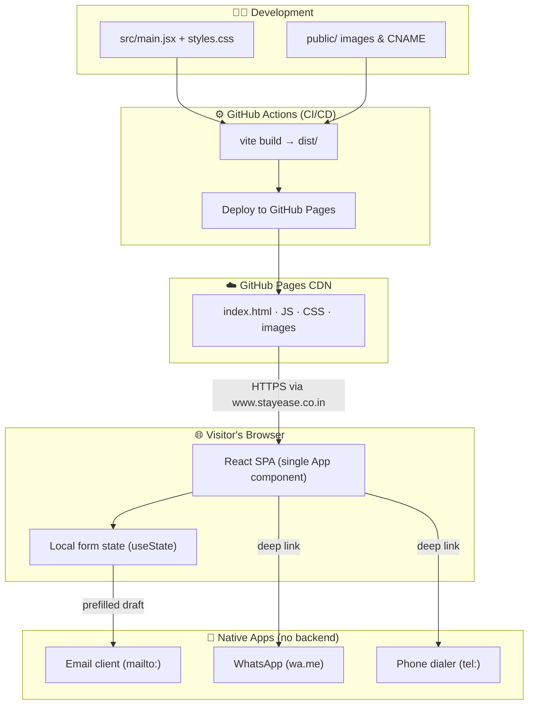
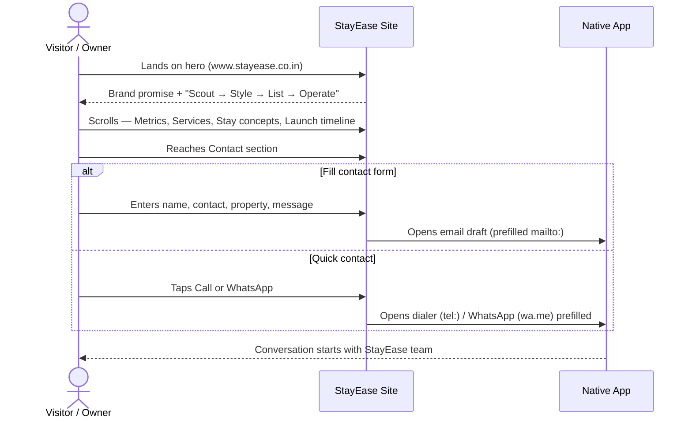
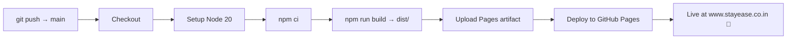

<div align="center">

# 🏡 StayEase

### Beautiful homes, operated with ease.

**A Chennai-focused short-stay hospitality concept** — lease promising apartments, style them into guest-loved stays, list them on Airbnb & Booking.com, and operate the guest experience end to end.

[](https://github.com/GithAsh-dev/StayEase/actions/workflows/deploy.yml)
&nbsp;·&nbsp; **Live:** [www.stayease.co.in](https://www.stayease.co.in)
&nbsp;·&nbsp; React • Vite • GitHub Pages

</div>

---

## 📑 Table of Contents

- [Problem & Solution](#-problem--solution)
- [Features](#-features)
- [Tech Stack](#-tech-stack)
- [Architecture](#-architecture)
- [User Flow](#-user-flow)
- [Deployment Pipeline (CI/CD)](#-deployment-pipeline-cicd)
- [File Structure](#-file-structure)
- [Run Locally](#-run-locally)
- [Deploy](#-deploy)
- [Future Scope](#-future-scope)
- [Team](#-team)
- [Change Log](#-change-log)

---

## 🎯 Problem & Solution

**Problem** — Property owners in Chennai have apartments sitting idle or under-earning on long leases, while travellers struggle to find consistently styled, well-operated short stays.

**Solution** — StayEase is a lean, repeatable operating model that turns underused homes into premium, bookable stays:

> **Scout → Style → List → Operate.**
> We lease/rent the right homes, upgrade interiors for guest appeal, launch professional listings across travel platforms, and run day-to-day guest operations.

This repository is the **public-facing marketing site** — the front door for owners and partners to discover the model and start a property conversation.

---

## ✨ Features

- **Premium hospitality landing page** with a warm, Chennai-inspired light theme.
- **Operating metrics** — launch sprint speed, listing channels, guest-response rhythm.
- **Service cards** — lease-ready scouting, aesthetic setup, listing launch, guest operations.
- **Image-led stay concepts** using generated apartment imagery.
- **Launch timeline** — from property shortlist to first guest.
- **Zero-backend contact** — a contact form that opens a prefilled email draft (`mailto:`), plus per-person **Call** and **WhatsApp** deep links.
- **Fully responsive** and accessible (semantic landmarks, ARIA labels, keyboard-friendly).

---

## 🧰 Tech Stack

| Layer | Choice | Why |
|-------|--------|-----|
| **UI library** | React 18 | Component model for a single-page experience |
| **Build tool** | Vite 6 | Instant dev server + optimized production bundle |
| **Icons** | lucide-react | Lightweight, consistent SVG icon set |
| **Styling** | Custom CSS + CSS variables | Full control of the premium theme, no framework weight |
| **Fonts** | Fraunces (display) + Manrope (body) | Editorial, hospitality feel |
| **Hosting** | GitHub Pages | Free static hosting on a custom domain |
| **CI/CD** | GitHub Actions | Build + deploy on every push to `main` |
| **Domain/DNS** | GoDaddy → `www.stayease.co.in` | Custom branded URL |

> **No backend.** The site is 100% static. Contact actions deep-link into the visitor's own email client and WhatsApp — nothing is stored server-side, which keeps it fast, free, and privacy-friendly.

---

## 🏗 Architecture

StayEase is a **client-only static single-page application**. The browser downloads a small bundle from a CDN; all interactivity (form state, deep links) runs locally in React. There is no server, database, or API.



**Key design decisions**

- **Single-component app** — the entire UI lives in [`src/main.jsx`](src/main.jsx) as one `App` component, with content modelled as plain data arrays (`metrics`, `services`, `steps`, `stays`, `contacts`). Easy to read and edit fast during a hackathon.
- **Data-driven sections** — adding a service or stay is a one-line edit to an array, not new JSX.
- **Backend-free contact** — `mailto:`/`wa.me`/`tel:` links mean zero infra, zero secrets, instant deploy.
- **Custom-domain-ready** — `public/CNAME` is bundled into `dist/` so the domain survives every deploy.

---

## 🔁 User Flow



---

## 🚀 Deployment Pipeline (CI/CD)

Every push to **`main`** triggers [`.github/workflows/deploy.yml`](.github/workflows/deploy.yml):



- **Trigger:** push to `main` (or manual `workflow_dispatch`).
- **Output:** the `dist/` folder (including `CNAME`) is published to GitHub Pages.
- **Custom domain:** GitHub Pages serves the site at `www.stayease.co.in` once GoDaddy DNS points to it (see [Deploy](#-deploy)).

---

## 📁 File Structure

```text
StayEase/
├── .github/
│   └── workflows/
│       └── deploy.yml          # CI/CD — build & deploy to GitHub Pages on push to main
├── public/                      # Static assets copied verbatim into dist/
│   ├── images/
│   │   ├── stayease-hero.png    # Hero background
│   │   ├── stayease-bedroom.png # "The Calm Suite" concept
│   │   ├── stayease-balcony.png # "Filter Coffee Balcony" concept
│   │   ├── stayease-bg.png      # Background texture
│   │   └── stayease-logo.png    # Nav logo
│   ├── logo/                    # GithAsh brand logos
│   └── CNAME                    # Custom domain (www.stayease.co.in) for GitHub Pages
├── src/
│   ├── main.jsx                 # Entire React app: data, App component, mount
│   └── styles.css               # Full responsive theme (CSS variables, ~800 lines)
├── index.html                   # Vite entry HTML (mounts #root)
├── package.json                 # Scripts & dependencies
├── package-lock.json
├── LICENSE
└── README.md                    # You are here
```

> **Where to make changes fast**
> - Copy / sections / data → [`src/main.jsx`](src/main.jsx)
> - Colors, spacing, layout → [`src/styles.css`](src/styles.css) (theme tokens live in the `:root` block)
> - Images → `public/images/`

---

## 💻 Run Locally

**Prerequisites:** Node.js 18+ and npm.

```bash
# 1. Install dependencies
npm install

# 2. Start the dev server (hot reload)
npm run dev -- --host 127.0.0.1
# → http://127.0.0.1:5173/

# 3. Production build
npm run build        # outputs to dist/

# 4. Preview the production build
npm run preview      # → http://127.0.0.1:4173/
```

---

## 🌍 Deploy

The project auto-deploys to **GitHub Pages** on every push to `main`.

**Custom domain — GoDaddy DNS for `stayease.co.in`:**

| Type | Host | Value |
|------|------|-------|
| CNAME | `www` | `githash-dev.github.io` |
| A | `@` | `185.199.108.153` |
| A | `@` | `185.199.109.153` |
| A | `@` | `185.199.110.153` |
| A | `@` | `185.199.111.153` |

Then, in **GitHub → Settings → Pages**: set Source to **GitHub Actions**, add `www.stayease.co.in` as the custom domain, and enable **Enforce HTTPS** once DNS verifies.

> ℹ️ GitHub Pages requires a **public** repo on the free plan; this repo is public for that reason.

---

## 🔮 Future Scope

A roadmap from "marketing site" to "operating platform":

| Phase | Idea | Notes |
|-------|------|-------|
| 🟢 Near term | **Real backend for the contact form** | Replace `mailto:` with a serverless function (e.g. Cloudflare Workers / Vercel) + email API so leads are captured even without an email client. |
| 🟢 Near term | **Lead dashboard** | Store enquiries in a lightweight DB (Supabase/Firebase) with a simple admin view. |
| 🟡 Mid term | **Live availability & booking** | Sync calendars from Airbnb/Booking.com (iCal) and show real-time availability per property. |
| 🟡 Mid term | **Property catalogue** | Per-property pages with galleries, amenities, maps, and reviews. |
| 🟡 Mid term | **Multilingual (Tamil/English)** | Broaden reach for local owners. |
| 🔵 Long term | **Owner portal** | Earnings, occupancy, and payout transparency for partner owners. |
| 🔵 Long term | **Dynamic pricing engine** | Demand- and seasonality-based rate suggestions. |
| 🔵 Long term | **AI guest concierge** | Chat assistant for check-in, local recommendations, and support. |
| 🔵 Long term | **Analytics & reviews loop** | Review-sentiment tracking that feeds back into operations and styling. |

**Quick technical wins**
- Add SEO meta tags, Open Graph / Twitter cards, and a sitemap.
- Lighthouse pass (image `loading="lazy"`, preloading hero, font-display tuning).
- Bump the GitHub Actions Node version (20 → 22) to clear the deprecation warning.
- Add unit/visual tests and a PR preview deploy.

---

## 👥 Team

**StayEase Chennai** — `stayeasechennai@gmail.com`

| Name | Contact |
|------|---------|
| Githin | +91 92072 94868 |
| Ashna | +91 99950 84157 |

---

## 📝 Change Log

### 2026-06-26

- Added a **multi-page Vite build** (`vite.config.js`) so `/chennai` is served as a real static page (`chennai/index.html`) — works on GitHub Pages with no SPA fallback hack. The page reuses the homepage via a shared `src/App.jsx`.
- Extracted the `App` component into `src/App.jsx`; `src/main.jsx` (homepage) and `src/chennai.jsx` (`/chennai`) both mount it. Restored the `import React` that the classic JSX runtime needs (this project has no `@vitejs/plugin-react`), verified `/chennai/` renders in the browser, and confirmed `npm run build` emits both `dist/index.html` and `dist/chennai/index.html`.
- **Rewrote `README.md`** into a hackathon-ready document: problem/solution, features, tech stack, architecture & flow diagrams (Mermaid), CI/CD pipeline, file structure, and future scope.
- Restricted the deploy workflow to the `main` branch only so production deploys from the default branch.
- Enabled GitHub Pages, set custom domain `www.stayease.co.in`, and deployed the site; made the repository public so Pages is available on the free plan.
- Added `public/CNAME` (`www.stayease.co.in`) so the GitHub Pages custom domain persists across deploys; Vite copies it into `dist/` on build.
- Verified `npm run build` passes and `dist/CNAME` is present.

### 2026-04-26

- Added a GitHub Actions workflow to build the Vite app and deploy `dist` to GitHub Pages.
- Documented GitHub Pages deployment and GoDaddy custom domain setup for `www.stayease.co.in`.
- Added `.codex/` to `.gitignore` because `environment.toml` is autogenerated local Codex workspace metadata and is not required for the deployed website.
- Added `public/images/stayease-logo.png` to the website navigation as the StayEase logo.
- Added a contact form that opens a prefilled email draft to `stayeasechennai@gmail.com`.
- Added contact numbers `+91 92072 94868` for Githin and `+91 99950 84157` for Ashna.
- Refined contact cards so each person's name appears once, with call and WhatsApp actions grouped beneath it.
- Added WhatsApp redirect buttons for both contact numbers.
- Polished the mobile contact layout and compact navigation icon.
- Created `README.md` as the living project documentation and change log.
- Fixed blank-screen issue by mounting the React app with `createRoot(...).render(...)` in `src/main.jsx`.

### 2026-04-25

- Created the initial StayEase React + Vite website.
- Generated and added three website images under `public/images`.
- Added responsive landing page sections for brand, services, stay concepts, launch process, and contact.
- Verified `npm run build` passes.
- Started the local dev server at `http://127.0.0.1:5173/`.

## Maintenance Note

Whenever the project changes, update the `Change Log` section in this file with:

- Date
- Files or areas changed
- Short reason for the change
- Any verification done, such as `npm run build`
